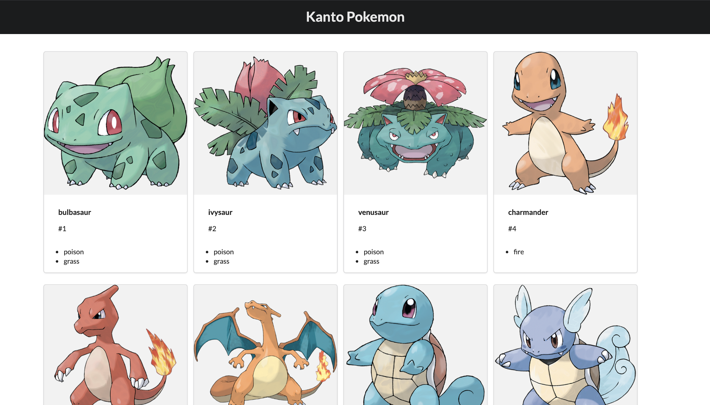

### Poke API

Gotta catch them all.

In this exercise, you will be creating Pokemon cards
of 20 of the most popular Pokemon characters taken from the Pokemon Api.

https://pokeapi.co/

Create a grid with each of the Pokemons with it's strenghts, weaknesses, powers, levels and other information.

Also add a route to each individual card that you can open with more information.

You are free to style the grid however you want.

# Definition of Done

The task is complete when a grid of 20 pokemons are shown in the frontend to the user. The
date should be provided from [pokeapi.co](https://pokeapi.co/).

# Submitting the Test

Once you are done please email the contact you have here at Code Labs with a link to your repository, and we will start
reviewing it.

# Time frame

We believe this assignment will take roughly 2 hours to complete.

# Technical Discussion

Once we have reviewed the test you will be invited for a second interview where will talk some code and get to know
each other 😄 We will of course talk a lot about the test. Remember that we understand that you cannot write a
production ready solution in just 2 hours, so no pressure on writing a perfect solution. We do however have some
expectations though:

- The solution should build and run, or more specifically, the commands `yarn start` and `yarn test` should
  return successfully
- We do expect for obvious reasons that you are familiar with your code, we will ask you to explain parts of your
  code, and to reason about technical decisions. So it might be a good idea to read through you code again before the
  discussion.

During the discussion we are not going to put much effort into grilling you about the history of JavaScript, "why eval
is bad?" or "what differs double from tripple-equals?", instead we are going to focus more on code organization, good
development patterns, how to cope with regression, and how to maintain good code quality.

Don't worry! We believe you got this! So just take it chill, and we're going to have a great time!

# Bonus Points

- Pagination - A single page of 20 characters is good and all, but what if we need more info! 🙈
